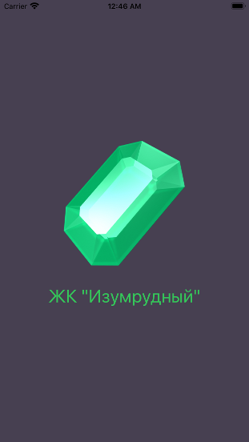
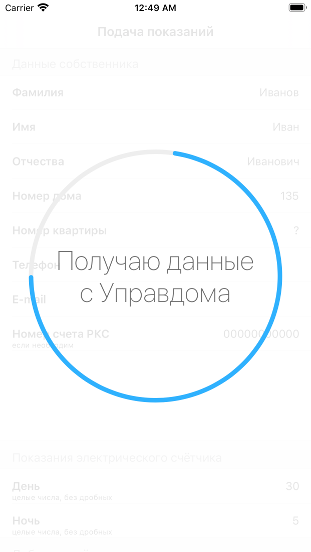
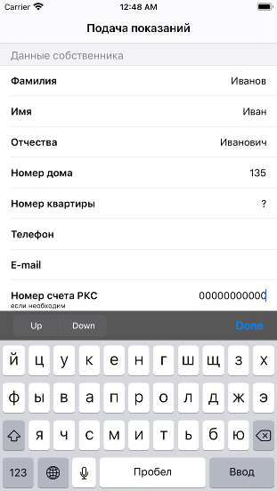

# Открытый урок в Отус

Форк был сделан для демонстрации возможностей фреймворка Vapor 4 для заглушки реального сервиса и нормальной работы UnitTests на проекте.
Заглушка сервиса лежит вот [здесь](server)

Темма урока: "Как Swift может помочь с заглушками сервисов или как не зная других языков стать фулстек iOS разработчиком с использованием фреймворка Vapor"

Площадка: [Otus](https://otus.ru/lessons/advanced-ios/).

Презентацию можно посмотреть [по ссылке](Presentation.pdf)

# Видеоматериал по уроку:

# ЖК "Изумрудный"

Приложение для жильцов комплекса "Изумрудный" в Самаре, для удобной отправки показаний.
Распространяется свободно с исходным текстом программы в [AppStore для операционной системы iOS](https://apps.apple.com/ru/app/%D0%B6%D0%BA-%D0%B8%D0%B7%D1%83%D0%BC%D1%80%D1%83%D0%B4%D0%BD%D1%8B%D0%B9/id1529496229) согласно лицензии [GNU GPL 3.0](https://www.gnu.org/licenses/quick-guide-gplv3.ru.html)

# Скриншоты

  

# Лицензия

[GNU GPL 3.0](https://www.gnu.org/licenses/quick-guide-gplv3.ru.html)